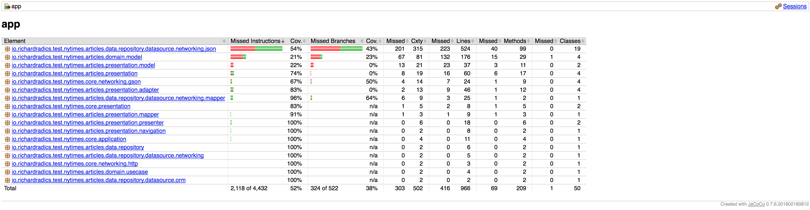
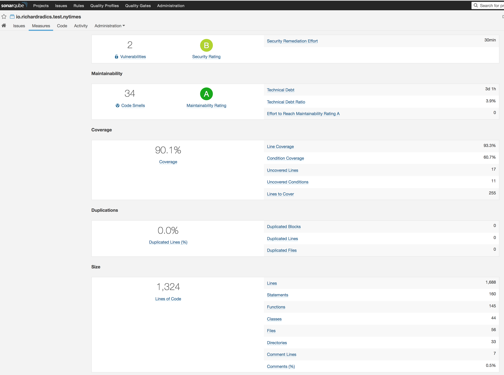

# New York Times - Most Popupar API Test project


## Run project

* Create a `nytimes.properties` file under the `app` module with the following content

```
sonarUrl=your-sonar-url
sonarLogin=your-sonar-token
nyTimesApiKey=your-nytimes-most-popular-api-key
```

* Then `./gradle assembleDebug`

## Running tests

* `sonarqube` is optional
* After a first install,  you have to grant write storage permission manually in the settings for spoon screenshots

```

Tests & coverage generation, upload to sonarqube
./gradlew installDebug createDebugCoverageReport jacocoTestReport sonarqube

Unit Tests with coverarage generation
./gradlew installDebug createDebugCoverageReport jacocoTestReport

UI tests with spoon
./gradlew spoon

Unit tests
./gradlew testDebugUnitTest

```

## Screenshots





